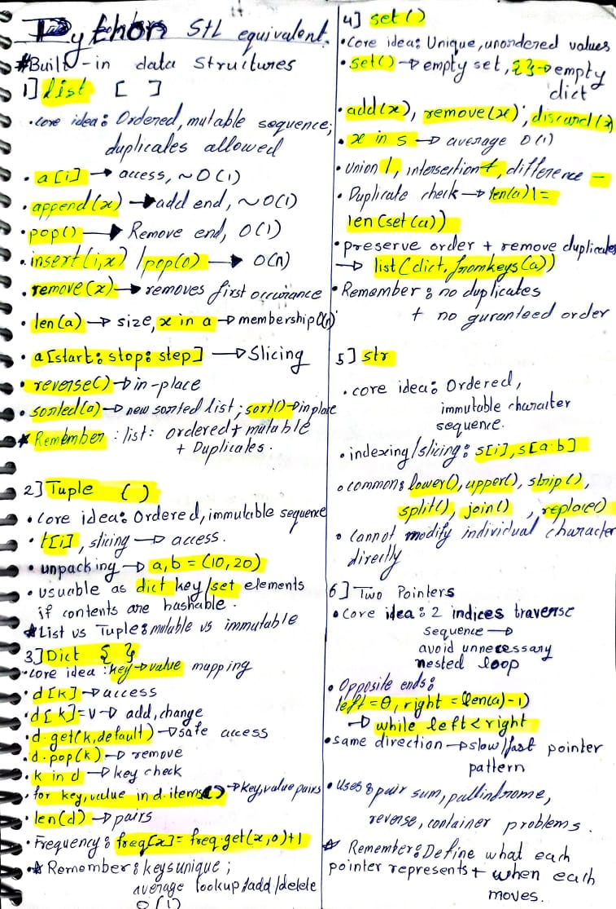
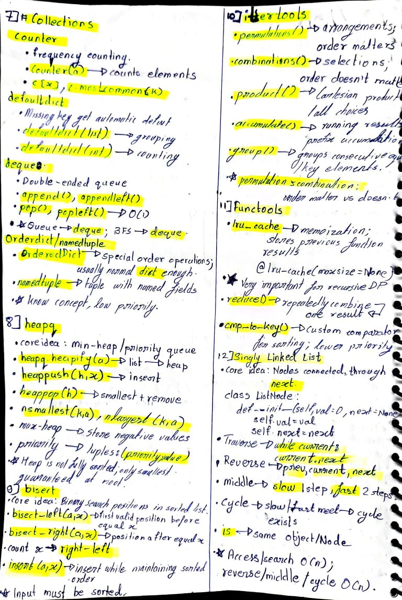
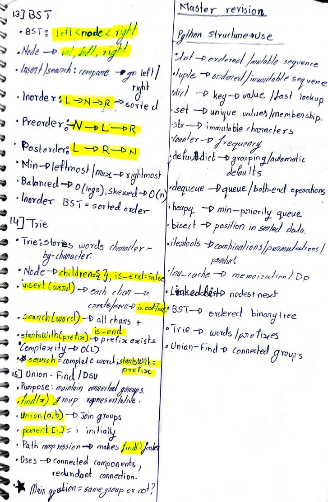
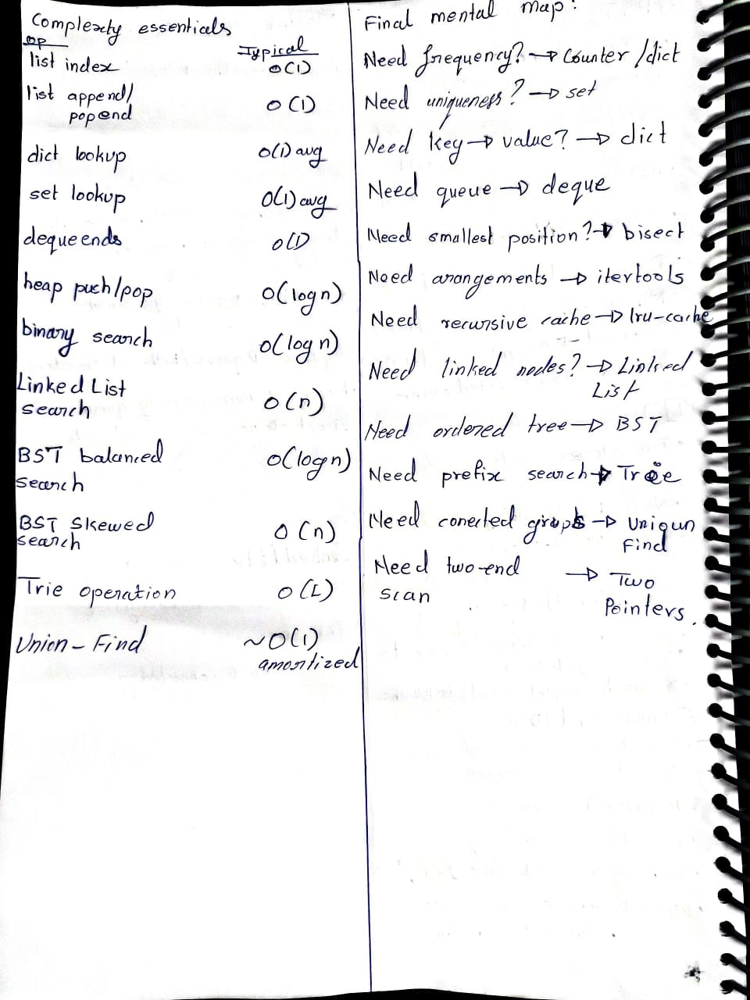

## Page 1


## Page 2


## Page 3


## Page 4

### 1. `list` ⭐
- **Core idea:** Ordered, mutable sequence; duplicates allowed.
- `a[i]` → access O(1)
- `append(x)` → add end, ~O(1)
- `pop()` → remove end, O(1)
- `insert(i,x)` / `pop(0)` → O(n)
- `remove(x)` → remove first occurrence
- `len(a)` → size; `x in a` → membership O(n)
- `a[start:stop:step]` → slicing
- `reverse()` → in-place; `sorted(a)` → new sorted list; `sort()` → in-place
- ⭐ **Remember:** list = ordered + mutable + duplicates.

### 2. `tuple`
- **Core idea:** Ordered, **immutable** sequence.
- `t[i]`, slicing → access
- unpacking → `a,b = (10,20)`
- usable as `dict` key / `set` element if contents are hashable
- ⭐ **list vs tuple:** mutable vs immutable.

### 3. `dict`
- **Core idea:** `key → value` mapping; Python 3.7+ preserves insertion order.
- `d[k]` → access
- `d[k]=v` → add/change
- `d.get(k,default)` → safe access
- `d.pop(k)` → remove
- `k in d` → key check
- `d.items()` → key-value pairs
- `len(d)` → pairs
- Frequency:
  `freq[x] = freq.get(x,0)+1`
- ⭐ **Remember:** keys unique; average lookup/add/delete O(1).

### 4. `set`
- **Core idea:** Unique, unordered values.
- `set()` → empty set; `{}` → empty dict
- `add(x)`, `remove(x)`, `discard(x)`
- `x in s` → average O(1)
- union `|`, intersection `&`, difference `-`
- duplicate check → `len(a) != len(set(a))`
- preserve order + remove duplicates → `list(dict.fromkeys(a))`
- ⭐ **Remember:** no duplicates + no guaranteed order.

### 5. `str`
- **Core idea:** Ordered, immutable character sequence.
- indexing/slicing → `s[i]`, `s[a:b]`
- common: `lower()`, `upper()`, `strip()`, `split()`, `join()`, `replace()`
- ⭐ Cannot modify individual character directly.

### 6. Two Pointers
- **Core idea:** 2 indices traverse sequence → avoids unnecessary nested loops.
- Opposite ends:
  `left=0, right=len(a)-1`
  → `while left < right`
- Same direction → slow/fast pointer pattern.
- Uses: pair-sum, palindrome, reverse, container problems.
- ⭐ **Remember:** define what each pointer represents + when each moves.

---

## PAGE 2/4

### 7. `collections`
**`Counter`**
- Frequency counting.
- `Counter(a)` → counts elements
- `c[x]`, `c.most_common(k)`

**`defaultdict`**
- Missing key gets automatic default.
- `defaultdict(list)` → grouping
- `defaultdict(int)` → counting

**`deque`**
- Double-ended queue.
- `append()`, `appendleft()`
- `pop()`, `popleft()` → O(1)
- ⭐ Queue → `deque`; BFS → `deque`.

**`OrderedDict` / `namedtuple`**
- `OrderedDict` → special order operations; usually normal `dict` enough.
- `namedtuple` → tuple with named fields.
- ⭐ Know concept, low priority.

### 8. `heapq` ⭐
- **Core idea:** Min-heap / priority queue.
- `heapq.heapify(a)` → list → heap
- `heappush(h,x)` → insert
- `heappop(h)` → smallest + remove
- `nsmallest(k,a)`, `nlargest(k,a)`
- max-heap → store negative values
- priority → tuples: `(priority,value)`
- ⭐ Heap is **not fully sorted**; only smallest guaranteed at root.

### 9. `bisect`
- **Core idea:** Binary-search positions in **sorted** list.
- `bisect_left(a,x)` → first valid position before equal x
- `bisect_right(a,x)` → position after equal x
- count x → `right-left`
- `insort(a,x)` → insert while maintaining sorted order
- ⭐ Input must be sorted.

### 10. `itertools`
- **`permutations()`** → arrangements; **order matters**
- **`combinations()`** → selections; **order doesn't matter**
- **`product()`** → Cartesian product / all choices
- **`accumulate()`** → running results / prefix accumulation
- **`groupby()`** → groups **consecutive** equal/key elements
- ⭐ `permutation ≠ combination`: order matters vs doesn't.

### 11. `functools`
- **`lru_cache`** → memoization; stores previous function results.
```python
@lru_cache(maxsize=None)
```
- ⭐ Very important for recursive DP.
- `reduce()` → repeatedly combine → one result.
- `cmp_to_key()` → custom comparator for sorting; lower priority.

### 12. Singly Linked List ⭐
- **Core idea:** Nodes connected through `next`.
```python
class ListNode:
    def __init__(self,val=0,next=None):
        self.val=val
        self.next=next
```
- Traverse → `while current: current=current.next`
- Reverse → `prev`, `current`, `next`
```text
nxt=current.next
current.next=prev
prev=current
current=nxt
```
- Middle → `slow` 1 step, `fast` 2 steps.
- Cycle → slow/fast meet → cycle exists.
- `is` → same object/node.
- ⭐ Access/search O(n); reverse/middle/cycle O(n).

---

## PAGE 3/4

### 13. BST ⭐
- **Core idea:** Binary tree where:
  `left < node < right`
- Node:
```python
class TreeNode:
    def __init__(self,val,left=None,right=None):
        self.val=val
        self.left=left
        self.right=right
```
- **Insert:** compare → left/right → recursively insert.
- **Search:** compare → eliminate one subtree.
- **Inorder:** `Left → Node → Right` → **sorted order**
- Preorder → `Node → Left → Right`
- Postorder → `Left → Right → Node`
- Minimum → leftmost node
- Maximum → rightmost node
- Height:
  `1 + max(left_height,right_height)`
- Balanced → ~O(log n) search/insert
- Skewed → O(n)
- Traversal → O(n)
- ⭐ **Inorder of BST = sorted values.**

### 14. Trie ⭐
- **Core idea:** Tree storing words **character by character**.
```python
class TrieNode:
    def __init__(self):
        self.children={}
        self.is_end=False
```
- `children` → next characters
- `is_end` → complete word ends here
- Trie:
  `self.root = TrieNode()`
- **Insert:**
  `root → each char → create if absent → move → is_end=True`
- **Search:** follow every char → final `is_end`
- **startsWith:** follow prefix → existence enough
- Complexity → O(L), L = word/prefix length.
- ⭐ `search("app")` ≠ `startsWith("app")`.

### 15. Union-Find / DSU ⭐
- **Core idea:** Maintains groups/components.
- `find(x)` → representative/root of x's group.
- `union(a,b)` → joins two groups.
- Initial:
  `parent = [0,1,2,...,n-1]`
- Path compression:
```python
if parent[x] != x:
    parent[x] = find(parent[x])
```
- Union:
```python
ra=find(a); rb=find(b)
if ra != rb:
    parent[rb]=ra
```
- Applications → connected components, redundant connection.
- ⭐ Main question: **“Are these two nodes in the same group?”**

---

## PAGE 4/4

# MASTER REVISION — ALL 15–16 TOPICS

### Python Structure → Use
```text
list       → ordered/mutable sequence
tuple      → ordered/immutable sequence
dict       → key → value / fast lookup
set        → unique values / membership
str        → immutable characters
Counter    → frequency
defaultdict→ grouping / automatic defaults
deque      → queue / both-end operations
heapq      → min-priority queue
bisect     → position in sorted data
itertools  → combinations/permutations/product
lru_cache  → memoization / DP
LinkedList → nodes + next
BST        → ordered binary tree
Trie       → words/prefixes
Union-Find → connected groups
```

### Must-Know Functions
```text
list:      append, pop, remove, sort, reverse
dict:      get, pop, items
set:       add, remove, discard, |, &, -
Counter:   most_common
deque:     append, appendleft, pop, popleft
heapq:     heapify, heappush, heappop
bisect:    left, right, insort
itertools: permutations, combinations, product, accumulate
functools: lru_cache, reduce
```

### Must-Know Patterns
```text
Two Pointers → left/right or slow/fast
Linked List  → prev/current/next
BST          → compare → left/right
Trie         → character by character
Union-Find   → find roots → union groups
Heap         → smallest at root
Bisect       → sorted input → binary-search position
```

### Complexity Essentials
| Operation | Typical |
|---|---:|
| list index | O(1) |
| list append/pop end | O(1) |
| dict lookup | O(1) avg |
| set lookup | O(1) avg |
| deque ends | O(1) |
| heap push/pop | O(log n) |
| binary search | O(log n) |
| Linked List search | O(n) |
| BST balanced search | O(log n) |
| BST skewed search | O(n) |
| Trie operation | O(L) |
| Union-Find | ~O(1) amortized |

### ⭐ Final Mental Map
```text
Need frequency?       → Counter / dict
Need uniqueness?      → set
Need key → value?     → dict
Need queue?           → deque
Need smallest priority?→ heapq
Need sorted position? → bisect
Need arrangements?    → itertools
Need recursive cache? → lru_cache
Need linked nodes?     → Linked List
Need ordered tree?     → BST
Need prefix search?    → Trie
Need connected groups? → Union-Find
Need two-end scan?     → Two Pointers
```

**Page distribution:**  
**Page 1:** Topics 1–6  
**Page 2:** Topics 7–12  
**Page 3:** Topics 13–15  
**Page 4:** Master Revision / last-minute recall