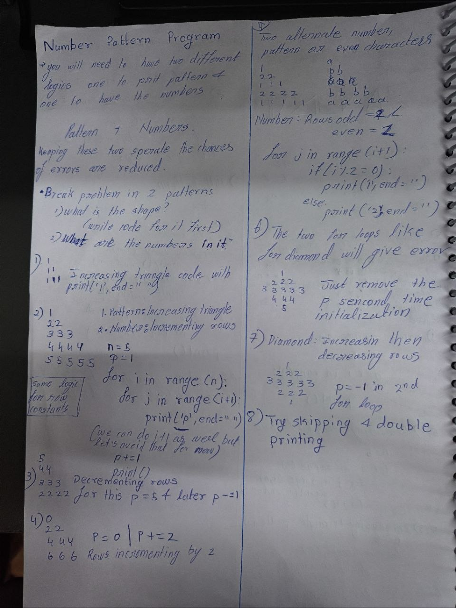
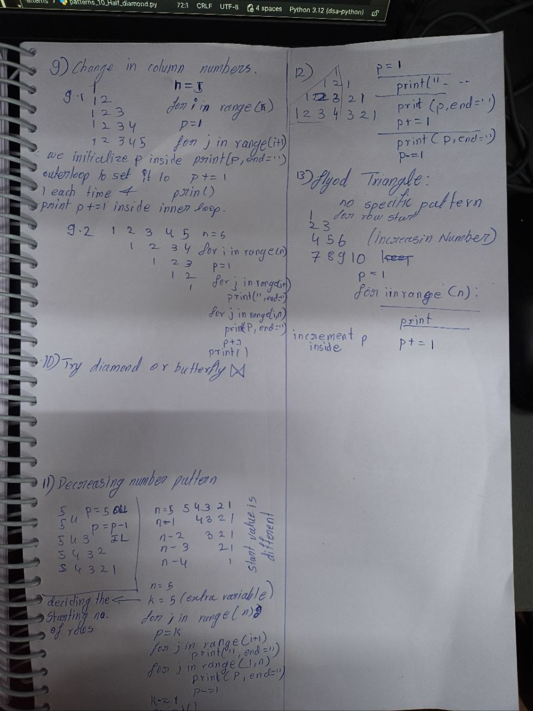

# Pattern Notes

## Pattern 01: Rectangle


**Date:** 05/08/2026

### Observation

* The **outer loop** runs `n` times, from `0` to `n - 1`, to control the rows.
* The **inner loop** runs `n` times, from `0` to `n - 1`, to control the columns.
* `print("*", end=" ")` is used inside the inner loop to print the stars while keeping the cursor on the same line.
* `print()` is used after the inner loop to move the cursor to the next line because `end=" "` keeps the cursor on the same line.

### Key Idea

> Outer loop → Rows
> Inner loop → Columns

---

## Pattern 02: Right-Angled Triangle


**Date:** 11/08/2026

### Observation

* The **outer loop** runs `n` times, from `0` to `n - 1`, to control the rows.
* The **inner loop** runs from `0` to `i + 1`.
* Since `i` increases with every row, the number of stars also increases with every row.
* `print("*", end=" ")` is used inside the inner loop to print stars on the same line.
* `print()` is used after the inner loop to move to the next line.

### Key Idea

The increasing pattern can be used to solve many similar pattern questions.

### Mistake

* Forgot to use `==` in:

```python
if __name__ == "__main__":
```

---

## Pattern 03: Right-Angled Increasing Number Pyramid





**Date:** 13/08/2026

### Observation

When printing patterns with numbers, focus on two different parts:

1. **Getting the basic pattern structure correct.**
2. **Adjusting the logic** using variables and `if-else` statements to produce the desired number pattern.

### Variable Logic

* The variable `p` is initialized **inside the outer loop**.
* This allows `p` to reset to its initial value at the beginning of every row.
* `p` is incremented **inside the inner loop** using:

```python
p += 1
```

* This makes the number increase after every printed value.

### Mistake

* Initially kept `p = 1` outside the outer loop.
* Keeping it inside the outer loop allows it to be initialized again for every new row.

### Key Idea

> If a variable needs to restart for every row → initialize it inside the outer loop.

---

## Pattern 04: Right-Angled Number Rows Incrementing Pyramid

**Date:** 13/08/2026

### Observation

When printing patterns with numbers, focus on two different parts:

1. **Getting the basic pattern structure correct.**
2. **Adjusting the logic** using variables and `if-else` statements to produce the desired number pattern.

### Variable Logic

* The variable `p` is initialized **outside the outer loop**.
* This allows `p` to continue from one row to the next.
* `p` is incremented **outside the inner loop**.
* Therefore, the same value of `p` is printed throughout one complete row before moving to the next number.

### Mistakes

* The function name and the function call were not the same.
* Used the trial value `1` directly inside the inner loop instead of using `p`.

### Key Idea

> If a variable needs to continue increasing after each row → keep it outside the outer loop.

---

## Pattern 05: Decreasing Right-Angled Triangle

**Date:** 13/08/2026

### Observation

* The **outer loop** runs `n` times, from `0` to `n - 1`, to control the rows.
* The **inner loop** controls the decreasing number of stars.
* The range is based on `i` and `n`, such as:

```python
range(i, n)
```

* As `i` increases, the number of iterations of the inner loop decreases.
* `print("*", end=" ")` is used inside the inner loop to print stars on the same line.
* `print()` is used after the inner loop to move to the next line.

### Key Idea

> Increasing `i` while keeping `n` fixed reduces the number of inner-loop iterations.

---

## Pattern 06: Inverted Numbered Right Pyramid

**Date:** 14/08/2026

### Observation

The goal is to have **increasing numbers in each row** while the number of columns decreases with every row.

### Variable Logic

1. Run the **outer loop** from `0` to `n - 1` to control the rows.
2. Initialize `p = 1` **inside the outer loop** so that it resets to `1` at the beginning of every row.
3. Run the **inner loop** from `i` to `n`:

```python
for j in range(i, n):
```

4. Print `p` inside the inner loop.
5. Increment `p` inside the inner loop:

```python
p += 1
```

6. Since `p` is incremented inside the inner loop, the numbers increase across each row.
7. After the inner loop finishes, use `print()` to move to the next line.

### Pattern Logic

```text
Outer loop → Controls rows
p = 1      → Resets number for every row
Inner loop → Controls decreasing columns
print(p)   → Prints current number
p += 1     → Increases number after every print
print()    → Moves to next row
```

### Key Idea

> Initialize `p` inside the outer loop when the number needs to restart from `1` on every row.

---

## Pattern 07: Hill Top

**Date:** 12/08/2026

### Observation

The pattern is divided into multiple parts:

1. An inner loop prints **spaces** to create the left indentation.
2. An inner loop prints the **increasing number of stars**.
3. Another inner loop completes the remaining stars required for the hill shape.
4. `print()` is used after all inner loops to move to the next line.

### Important Notes

1. The newline `print()` statement should come **after all the inner loops**.
2. The main spacing statement:

```python
print(" ", end=" ")
```

should use the **same number of characters/spaces** consistently across the inner loops.

### Mistake

* The middle inner-loop range was not adjusted correctly.
* The range needed to use `i` instead of `i + 1`.
* One column had to be removed to achieve the correct hill-top shape.

### Key Idea

> For centered patterns, carefully control the number of spaces and columns removed/added in each part.

---

## Pattern 08: Reverse Hill Top

**Date:** 12/08/2026

### Observation

The pattern is divided into multiple parts:

1. An inner loop prints **spaces**.
2. An inner loop controls the stars.
3. The range is adjusted to decrease the number of columns.
4. `print()` is used after all inner loops to move to the next line.

### Important Notes

1. The newline `print()` statement should come **after all the inner loops**.
2. The spacing statement:

```python
print(" ", end=" ")
```

should use the same number of characters/spaces consistently.

### Mistake

* The middle inner-loop range was initially:

```python
range(i, n)
```

but one column needed to be removed.

* It was changed to:

```python
range(i, n - 1)
```

to remove one column and obtain the correct reverse hill-top shape.

### Key Idea

> Sometimes changing the range by just one value, such as `n` → `n - 1`, is enough to correct the pattern.

---

## Pattern 09: Diamond

**Date:** 12/08/2026

### Observation

* The diamond is created by combining an **increasing hill** and a **decreasing reverse hill**.
* One row is removed while combining the two parts so that the middle row is not printed twice.
* The first part creates the upper half.
* The second part creates the lower half.
* Both parts use nested loops to control spaces and stars.

### Pattern Structure

The upper half follows:

1. Outer loop → controls rows.
2. Inner loop → prints decreasing spaces.
3. Inner loop → prints increasing stars.
4. Inner loop → prints the remaining stars.
5. `print()` → moves to the next row.

The lower half follows the reverse logic.

### Important Notes

1. The newline `print()` statement should come at the **end of all inner loops**.
2. The spacing statement:

```python
print(" ", end=" ")
```

should use the same number of characters/spaces in all inner loops.
3. One row should be removed while combining the two patterns to prevent duplication of the middle row.

### Mistake

* Did not remove one row while combining the increasing and decreasing patterns.
* This caused the middle row to appear twice and disturbed the diamond shape.

### Key Idea

> Diamond = Increasing pattern + Decreasing pattern - 1 common middle row.

---

## Pattern 10: Half Diamond

**Date:** 12/08/2026

### Observation

* First, print the **increasing right-angled triangle**.
* Then, print the **decreasing right-angled triangle** inside another `for` loop directly below it.
* The two triangles together form a half-diamond shape.
* One row needs to be removed when combining the two parts to avoid repeating the middle row.

### Pattern Structure

```text
Increasing Triangle
        +
Decreasing Triangle
        -
One repeated middle row
```

### Mistake

* Did not delete one row while combining the increasing and decreasing triangles.
* This caused the middle row to be printed twice and disturbed the proper half-diamond shape.

### Key Idea

> Half Diamond = Increasing Triangle + Decreasing Triangle - 1 common middle row.

---

# General Pattern Programming Notes

## 1. Understand the Loop Structure

For most pattern problems:

```text
Outer loop → Rows
Inner loop → Columns
```

The outer loop decides **how many rows** are printed.

The inner loop decides **what is printed inside each row**.

---

## 2. Understand `print()` and `end`

Normally:

```python
print("*")
```

prints `*` and moves to the next line.

To stay on the same line:

```python
print("*", end=" ")
```

After the inner loop finishes:

```python
print()
```

moves the cursor to the next line.

Therefore:

```python
for i in range(n):
    for j in range(n):
        print("*", end=" ")
    print()
```

means:

```text
Outer loop → Start a new row
Inner loop → Print everything in that row
print()    → Move to the next row
```

---

## 3. Range Is the Main Pattern-Control Mechanism

Small changes in `range()` can completely change the pattern.

Examples:

```python
range(n)
range(i + 1)
range(i, n)
range(i, n - 1)
```

### General Observation

* `range(n)` → fixed number of iterations.
* `range(i + 1)` → increasing iterations.
* `range(i, n)` → decreasing iterations as `i` increases.
* `range(i, n - 1)` → decreasing iterations with one fewer column.

> **When a pattern looks almost correct, check the `range()` first.**

---

## 4. Variable Placement Matters

Where a variable is initialized determines how it behaves.

### Initialize Inside the Outer Loop

```python
for i in range(n):
    p = 1
```

Use this when `p` needs to **restart for every row**.

### Initialize Outside the Outer Loop

```python
p = 1

for i in range(n):
    ...
```

Use this when `p` needs to **continue from the previous row**.

---

## 5. Variable Incrementation Matters

### Increment Inside the Inner Loop

```python
for j in range(...):
    print(p)
    p += 1
```

The value changes **after every printed element**.

### Increment Outside the Inner Loop

```python
for j in range(...):
    print(p)

p += 1
```

The same value is printed throughout the row, and the value changes **after the complete row**.

---

# Common Mistakes

* Forgetting `==` in:

```python
if __name__ == "__main__":
```

* Keeping a variable outside the outer loop when it needs to reset for every row.
* Keeping a variable inside the outer loop when it needs to continue across rows.
* Incrementing a variable in the wrong loop.
* Using a hardcoded value such as `1` instead of the required variable.
* Function name and function call not matching.
* Incorrect `range()` boundaries.
* Forgetting to remove one column from a pattern.
* Forgetting to remove one row when combining two patterns.
* Using inconsistent spacing in centered patterns.
* Placing `print()` before all inner loops have completed.

---

# Pattern Problem-Solving Approach

When solving a new pattern, follow this order:

## Step 1: Identify the Rows

Ask:

> How many rows are there?

This determines the **outer loop**.

---

## Step 2: Identify the Columns

Ask:

> How many characters are printed in each row?

This determines the **inner loop** and its `range()`.

---

## Step 3: Identify What Changes

Ask:

> Does the number of stars, spaces, or numbers increase or decrease?

This determines how `i`, `j`, or another variable should be used.

---

## Step 4: Identify Variable Behavior

Ask:

> Should the variable reset on every row or continue from the previous row?

This determines whether the variable belongs **inside or outside the outer loop**.

---

## Step 5: Check Spacing

For centered patterns, make sure the spaces printed by different inner loops have consistent character width.

---

## Step 6: Combine Patterns When Necessary

Complex patterns such as:

* Hill Top
* Reverse Hill Top
* Diamond
* Half Diamond

can often be solved by combining simpler patterns.

> **Break a complex pattern into smaller patterns first, then combine them.**

---

# Core Takeaways

1. **Outer loop = rows.**
2. **Inner loop = columns/content of each row.**
3. `end=" "` keeps printing on the same line.
4. `print()` moves to the next line.
5. `range()` controls the shape of the pattern.
6. Increasing `i` can naturally create increasing or decreasing patterns depending on the range.
7. Initialize a variable inside the outer loop when it needs to reset for every row.
8. Initialize a variable outside the outer loop when it needs to continue across rows.
9. Increment inside the inner loop when the value should change after every element.
10. Increment outside the inner loop when the value should change after every row.
11. Centered patterns require careful control of spaces.
12. Complex patterns can usually be broken into smaller patterns and then combined.
13. When a pattern is almost correct, first inspect the `range()` values.
14. When combining two patterns, check whether a common row needs to be removed.
15. **Understand the pattern first, then write the loops.**
