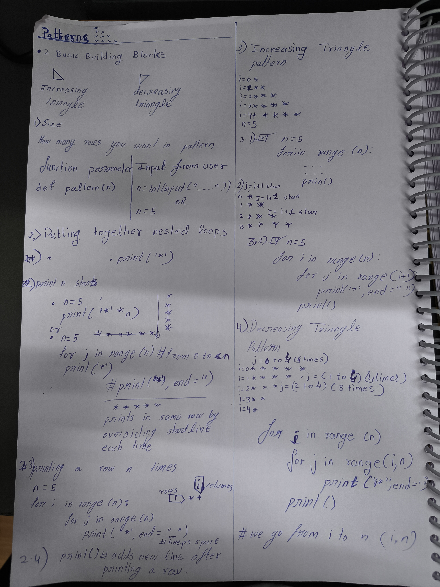
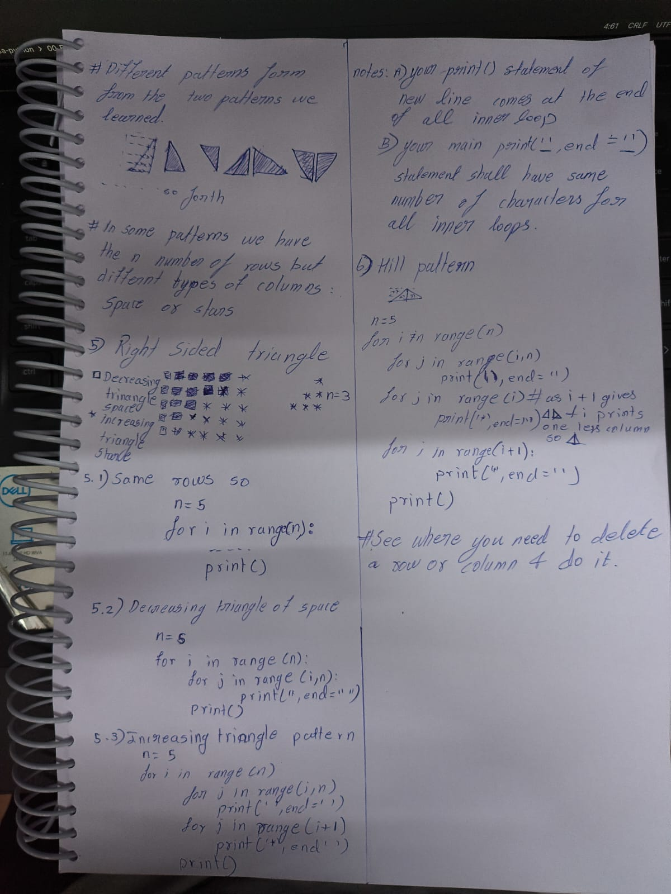

Notes:

Observation: 
patterns_01_rectangle: 5/8/2026

Outer loop prints for rows n times from 0 to n-1 \
Inner loop prints for n times from 0 to n-1 \
Print was used inside the inner loop for printing the star and end=" "was added to keep the cursor on the same line \
print() was used in outer loop to jump to next line as end= " " kept cursor on the same line.

Observation: 
patterns_01_rectangle: 11/8/2026

Outer loop prints for rows n times from 0 to n-1
Inner loop prints for n times from 0 to i+1
Print was used inside the inner loop for printing the star and end=" "was added to keep the cursor on the same line
print() was used in outer loop to jump to next line as end= " " kept cursor on the same line.

Using increasing pattern we can solve similar questions
i remains the same we just the space and columns for the j
mistakes: forgot to add 2 == after if __name__ ==

